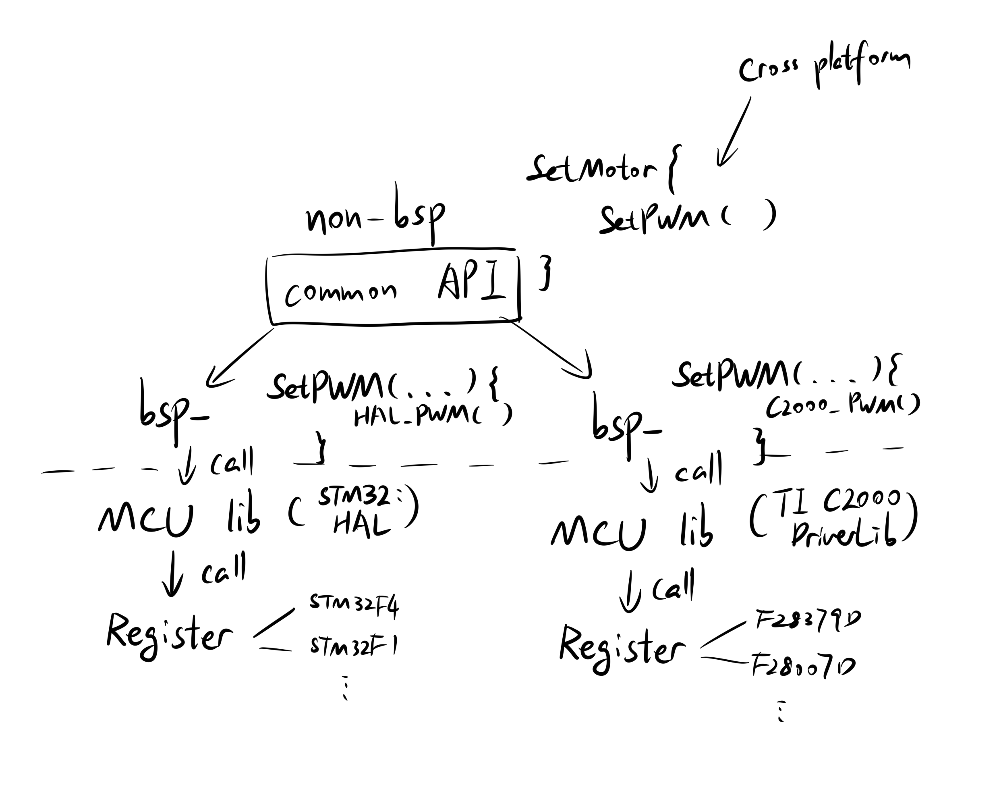
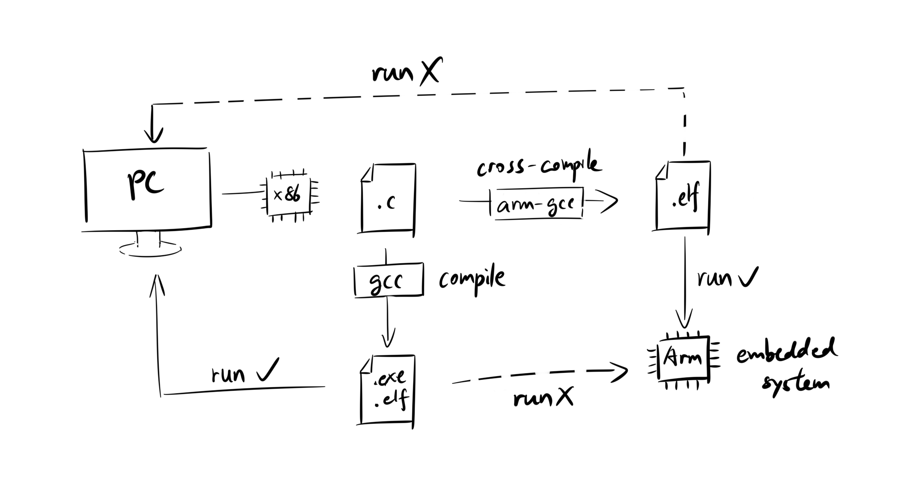
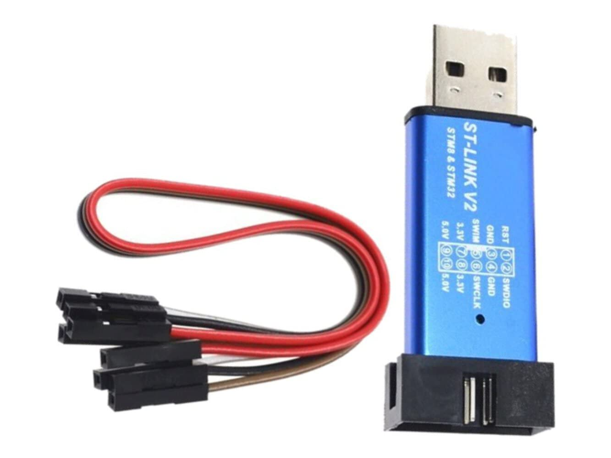
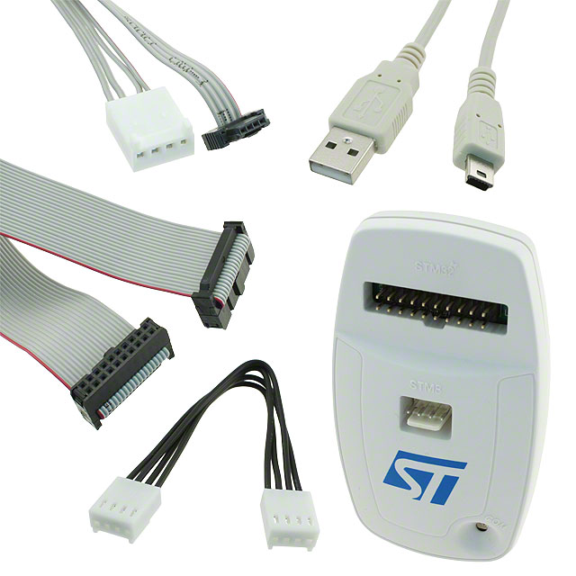
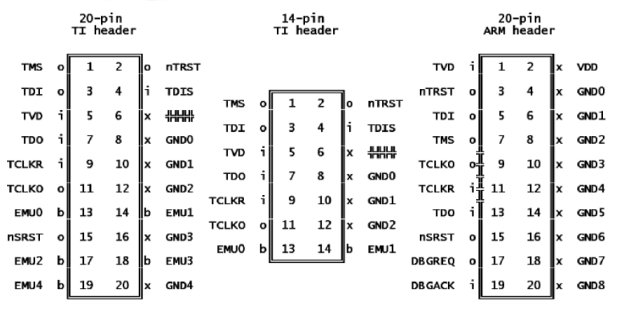
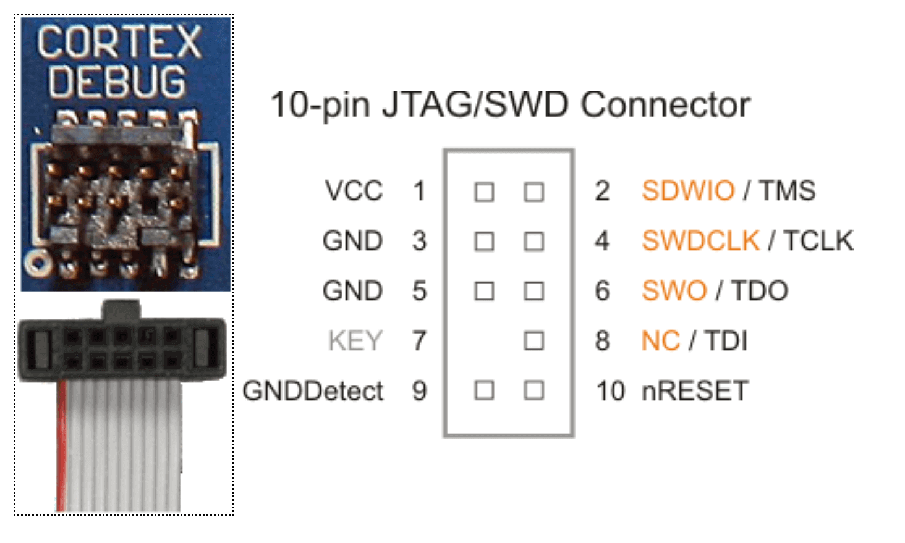
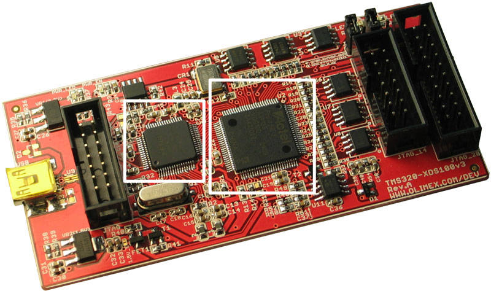
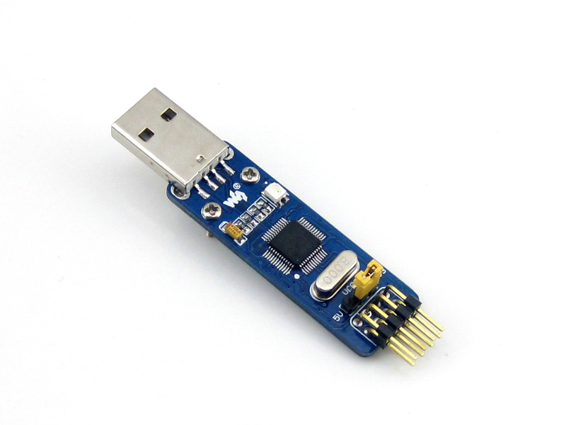

# Embedded IDE Lobotomy

2024.10

If you have ever spent some time programming an embedded system, you might agree that working with embedded IDEs is not a very pleasant experience. Code Composer Studio, Keil, STM32CubeIDE... they are clumsy and confusing as they hide everything under a GUI.

To get rid of embedded IDEs, I put many efforts to find out what is happening behind them. Today, I still can't say confidently that I've learnt everything about them, but I went through many interesting topics, interesting enough for me to **replace every part of an IDE with some open sourced command-line tools.**

Then, I met some other people with the same interest, which gave me a reason to write down my findings. That's why I wrote this beginner's guide: **To show Embedded Engineers what is happening behind an Embedded IDE, from source code to a running program on MCU, by replacing every step with Command-line tools**.

Even if you don't want to replace your IDE with command-line tools, I hope you can find something interesting reading this guide.

## Compile from commandline on PC

Computers speak machine code of 0's and 1's and each CPU family speaks a little different machine code. The most common example of this is AMD CPU with ARM architecture vs Intel CPU with x86-64 architecture. If you copy a exe file working on one to the other, it's likely* that it would not work or run very slow (because Windows is doing a real-time translation job).

> *I didn't try it. Some guy on stackoverflow claims this is true.

Writing program in machine code for every CPU ever built is impractical. So people decided to write program in a higher level language (C/C++). If each CPU can have their own translator from this higher level language to their machine code, a program can run on any CPU. This translator is called the "compiler".

> And the ability to run on different CPU families is called "cross platform". Like Python can run on ARM and x86 desktops.

#### GCC

`GCC (GNU Compiler Collection)` family is probably the most well-known C/C++ compiler**. To learn how to use `gcc` on a PC is our first step to understand embedded IDE.

> **Actually, most "compilers" today are drivers that call compiler, assembler, or linker depending on the input file and command.

Getting `gcc` on Linux is trivial. If you are on Windows, you can use a Linux virtual machine (I use `vmware player 17` + `Ubuntu 22.04`) or `MinGW-W64` + `Git Bash` (remember to add `mingw64/bin` to system PATH if you choose this way).

UCLA has a good [one-page tutorial](https://web.cs.ucla.edu/classes/fall14/cs143/project/cpp/gcc-intro.html) on how to use gcc to compile C/C++ program:

#### .exe, .out, and .elf

Let's take a look at what we have for gcc compilers.

```bash
gcc main.c
```

On Windows, this will give you `a.exe`.

On Linux, this will give you `a.out`.

We said compilers translate C to CPU specific machine code. If we are compiling against the same CPU, that means these 2 executables are the same thing, right? ...right?

**No.** Even though they contain the same* machine code, how the machine code is packaged into an executable is different.

> *Not entirely the same if we use external libraries or system calls.

When we try to run `a.out` on Windows, or `a.exe` on Linux, it doesn't work because these exectuables contain operating system specific information besides machine code.

`.exe (Executable)` file is a Microsoft OS specific executable format, while `.out` file is a Unix/Linux specific executable format called `Executable and Linkable Format (.elf)`.

> `.elf` and `.out` files are the same thing with different names. It's called `a.out` for only historical reasons.

So what are this extra OS specific information? Instructions for the OS about how to handle this executable. For example, relocation information: executables can ask OS to put them in a specific** memory address when running.

> **If multiple processes ask to locate at the same memory address, they will not collide because of virtual memory.

Okay but why do we care about these different executables and additional information for OS?

Because when we load programs to embedded MCU without an OS, these OS instructions are not needed. We can't load `.exe` or `.elf` to MCUs. Instead, we load binary files `.hex` or `.bin`, where everything (code/data) has a fixed address to a fixed memory address based on CPU design with a external hardware loader. Program counter of the MCU returns to this fixed memory address and starts running every time we reset the MCU.

#### Mildly more advanced compiling

Most "compilers" today are drivers that call compiler, assembler, and linker depending on the file input.

When we call:
```bash
gcc main.c
```

It takes 4 steps to convert this source file into an executable: preprocessing, compiling, assembling, and linking. There are many excellent tutorials on this topic. I would not redo their work. I found this lecture slide from University of North Carolina at Charlotte, [Introduction to Computer Architecture](https://passlab.github.io/ITSC3181/notes/lecture02_CompilationAssemblingLinkingProgramExecution.pdf) very helpful:


## How to control peripherals on MCU (4 layers of libraries we need to compile)

There are always many, many library source files in a embedded IDE project folder, but why do we need this many? In this chapter we will introduce the hierarchy of library for embedded system.

Let's start with an overview of all 4 layers of libraries of an embedded project. There are 4 layers: **Register level control** and **MCU library (manufacturer library)** are provided by the chip manufacturer; **bsp library** and **non-bsp library (higher level library)** are written by the user (you).

> Disclaimer: This is only the way I use to structure the project and by no means is a universal standard.



#### Register level control

At the very bottom is the **register level control**. All actions of a MCU is controlled by changing values of some registers. For example, to change the behavior of a GPIO between input mode and output mode, we need to change the control register of input/output multiplexer.

The code for register level control usually look like this:

```C
Blink an LED on MCU STC89C52
sfr and sbit are special data type defined for these MCUs

/*  BYTE Registers  */
sfr P0    = 0x80;
sfr P1    = 0x90;
sfr P2    = 0xA0;
sbit led = P2^0;

int main() {
  while(1) {
    led = 0;
    delay(5000);
    led = 1;
  }
}
```

#### MCU library (manufacturer library)

On top of register layer is what I called the "manufacturer library". When we program at the register level, you always need to know the **memory address** of a register to control it, which is tedious. So many MCU manufacturers write their library and you, the user, don't need to care about these registers. For example, `HAL` for `stm32` family, `Driverlib` for `TI C2000` family.

The code for MCU library level usually look like this:
```C
Blink an LED on MCU STM32F1
...
while (1)
{
  HAL_GPIO_WritePin(GPIOC, GPIO_PIN_9, 0);
  HAL_Delay(100);
  HAL_GPIO_WritePin(GPIOC, GPIO_PIN_9, 1);
}
...
```

Another benefit is many MCUs from the same family can use the same manufacturer library API. Now we are using `STM32F1`. If we want to switch to its close relative `STM32F4`, we can use the same piece of user code to blink LED on our new MCU.

#### Non-bsp library (high level library)

The entire point of bsp library is to make higher level library cross platform, so let's skip the bsp library for now and look at what non-bsp library is trying to do. The high level library's API depends on what embedded system you (the user) want to build. If designed properly, controlling your system with your high level library should be very convenient.

Suppose we want to build an LED array to display numbers and use PWM to control brightness. Sounds very complicated, but with properly designed high level library, our final user code using the high level library might look as simple as this:

```C
Display 4 on an LED array

led_array_t led_array = {some initialization here};
int main() {
  while (1) {
    DisplayNumber(led_array, 4);
    SetBrightness(led_array, 0.5); // Set brightness to 50%
  }
}
```
#### bsp library

Now we return to the bsp library. The bsp library is the bridge layer between MCU library and high level library. We define a common API between higher level library and bsp library. Then implement this common API with MCU library.

For example, if we want to implement the `SetBrightness()` function in the example above, with `stm32`'s `HAL` library, the implementation might be like this:
```C
in led_array.c, high level library
void SetBrightness(led_array_t *dev, float input) {
  SetPWM(dev, input);
}

in bsp_pwm.c, bsp library
// I didn't test this
void SetPWM(led_array_t *dev, float input) {
  uint32_t compare = input * dev->TIME_PERIOD;
  __HAL_TIM_SET_COMPARE(dev->htim, dev->channel, compare);
}
```

With `TI C2000`'s `Driverlib`, the implementation might be like this:
```C
in led_array.c, high level library
void SetBrightness(led_array_t *dev, float input) {
  SetPWM(dev, input);
}

in bsp_pwm.c, bsp library
// I didn't test this
void SetPWM(led_array_t *dev, float input) {
  uint32_t compare = input * dev->TIME_PERIOD;
  EPWM_setCounterCompareValue(dev->pwm_base, dev->compare_id, compare);
}
```

Since we defined the common API `SetPWM()`, The implementation of high level library gets to stay the same across different MCUs. This is what we meant by cross-platform. **If we change to a slightly different MCU or the MCU library changes, the common API between bsp library and high level library allow us to only change bsp library implementation, instead of all the final user code or high level libraries.**

## How to compile lots of source files (makefile and CMake)

With all the libraries we introduced in the last chapter, there will be numerous source files in the project and their number will keep increasing. We can't do this the same way as chapter 1 and we need an automatic way to manage these compilation. So, we introduce `makefile` and `CMake`.

There are many makefile and CMake tutorials but I feel many of them failed to stress on the core idea of **target**. So I'm writing another one as a supplementary to those tutorials. You might want to read this chapter before looking at the other CMake/makefile tutorials.

Suppose we have 2 source files, `hello.c` and `main.c`. We want to compile these 2 source files into an executable. From the first chapter **compiling from commandline** we know how to do this with `gcc`:

```bash
gcc hello.c main.c
```

If we want the output executable to have name `main.elf`, put it in folder `build/` specify that we are using `C11` standard, and add a hidden `#define DEBUG` macro to enable some debug setting in the source code, the command would be:

```bash
gcc hello.c main.c -o build/main.elf -std=c11 -DDEBUG
```

As there are more parameters we would like to add, the command grows longer. **Makefile** is a script language that allows us not to type the long command every time. Now we only need to type:

```bash
make build/main.elf
```

> To do this with MinGW on Windows, you need to rename `mingw32-make.exe` to `make.exe`

`make` will look for a file called `makefile` in the directory it is called and execute the commands in it. Let's look at what `makefile` have in our example:

```makefile
build/main.elf: hello.c main.c
    gcc hello.c main.c -o build/main.elf -std=c11 -DDEBUG
```

`build/main.elf` is the **target** (which is the most important concept for both makefile and CMake). For every target in the makefile script, `make` will check whether it exists and execute the command if the target doesn't exist.

`hello.c` and `main.c` are the **dependencies**. `make` will also execute the command if these files are changed since last build. If we have a dependency tree, only building necessary files will save a lot of time.

Command is just command. Notice it has to be a `tab` before the command and cannot be `whitespace`.

Now we know the 2 conditions for a command to run: **target doesn't exist or dependencies are changed**. We can write some interesting makefile scripts.

If the target is not created by the command, then this command will run every time we `make` because the target is always missing. For example:

```makefile
clean:
    rm *.out *.elf
```

If we run `make clean`, `makefile` will look for a file called `clean` in the current directory. Since there is no such file, the command will run and all `.out` and `.elf` files will be removed in the current directory.

> If there is such a file called `clean`, please refer to the makefile keyword: `.PHONY`

#### CMake

CMake is when our makefile is so long that we need to write another script to generate the makefile script. While `makefile` looks for a file named `makefile` in the current directory, `CMake` looks for a file named `CMakeLists.txt`. The most common use case is:

```bash
mkdir build
cd build
cmake ..
make <your target name>
```


Many tutorials on CMake focus too much on usage details which, in my opinion, makes them confusing and wordy. When you read these tutorials, keep in mind one thing: **(like makefile), CMake is all about targets**.

Remember makefile is all about targets and every line in makefile is about generating one target. CMake generates makefiles. **If no targets are defined, no action will be taken by this CMake.**

**There are only 3 functions that defines targets in CMake**:

```Python
# Executables that you can generate with GCC or GCC-like compilers
add_executable()

# Libraries (.a/.so files) that you can generate with GCC or GCC-like compilers
add_library()

# Something that generated from other commandline tools
# Example: python script that generate files
# ...Or nothing, remember make clean?
# We can use this to load programs to MCUs
add_custom_target()
```

The first two functions `add_executable()` and `add_library()` will detect if the target is created and if the dependencies are changed as `makefile` does. The third function `add_custom_target()`, however, will execute no matter what. Thus a little trick with `add_custom_target()` is to use it with loader binary like:

```c
add_custom_target(flash-${name}
    COMMAND st-flash --reset write ${BIN_FILE} 0x8000000
    DEPENDS ${name}.elf)
```

Now every time we run `make flash-<your binary name>` like `make flash-led`, the corresponding binary, in this case, `led.elf` will be loaded to your MCU with `st-flash`, a binary loader for `STM32` MCU family.

That's it. All about targets. That's core idea about CMake. No matter how many variables you defined or how many `execute_process()` you added, if there is no target to be generated, none of the CMake commands will be executed. **No matter how complex or scary the CMake structure looks, find out what targets this CMake is building and everything will be simple and clear.**

With that in mind you should be able to understand most of the CMake tutorials available.

> CMake is a very deep rabbit hole and how deep you decide to go in is up to you. I've warned you.

## Why PC can compile against MCU (Cross-compile and Toolchain)

To compile a source file to an executable. We can simply do:

```bash
gcc main.c
```

Recall the very beginning of our **chapter 1: compile from commandline on PC**, we know that:

1. Different MCU/CPUs speak different machine code
2. Executable for one platform (CPU + OS) cannot run on another platform.

These are the two primary reasons for having compilers, to translate source code into corresponding machine code. Wait! When we compile for a embedded system on PCs, how can the program run on the embedded MCU even if it is compiled on a PC? The answer is what we called **cross-compile**.

Let's examine the difference between **compile** and **cross-compile**:



> This graph is not quite accurate as `.elf` does not directly run on bare-metal embedded system and extra post-processing steps are needed.

For a source file `.c`, if we want to run it on our PC, we compile it with `gcc`; if we want to run it on our ARM architecture embedded system MCU, we cross-compile it with `arm-gcc`, a cross-compiler on our PC, and then generated executable can run on our embedded system.

`arm-gcc`, the cross-compiler, is one of the **cross-compiling toolchain** provided by the architecture designer. If we are using ARM MCUs, we can get our cross-compiling toolchain from ARM: [ARM Toolchain](https://developer.arm.com/downloads/-/arm-gnu-toolchain-downloads). This is a GNU Arm Toolchain, meaning it is an variation of the `gcc` family we've been talking about in the previous chapters and compatible to `makefile` and `CMake`. The usage is exactly the same as compiling against our PC.

#### Example:

Suppose our PC is x86-64 Ubuntu and our MCU is ARM architecture STM32F4. This is a **bare-metal target**, which means it doesn't have any operating systems on it. So the cross-compiling toolchain we get is `x86_64 Linux hosted cross toolchains AArch32 bare-metal target (arm-none-eabi)` and our cross-compiler is `arm-none-eabi-gcc`.

To use these in our `CMake` script, add the following commands:

```cmake
set(CMAKE_C_COMPILER arm-none-eabi-gcc)
set(CMAKE_CXX_COMPILER arm-none-eabi-g++)
```

The compiled result from arm toolchain compiler is a `.elf` file we discussed in the first chapter.

> Sometimes this result file is also referred as a `.axf` file, ARM executable file.

An `.elf` file contains information for operating system about relocation: how to place different sections of data and code into memory. A bare-metal embedded MCU cannot interpret these information so we need to make everything fixed before loading the program.

The tool we use here is `objcopy`, it converts `.elf` file into binary files `.bin` or `.hex`.

```bash
arm-none-eabi-objcopy -Obinary intput.elf output.bin
```

Now we can load the program into our MCU. Here we use the open source `stlink` library:

```bash
st-flash --reset write output.bin 0x8000000
```

Here `0x8000000` is the start address used by our MCU `STM32F4`. For different MCUs, we need to consult the chip technical manual for this flash address. An MCU always start running code from this address after a reset.

## What's inside a loader/debug probe/emulator

As the one last step to load and debug code in a MCU, we need a "loader". It looks something like this:





<br>
<br>

There are many names for them.
- Loader
- Flasher
- FTDI chip
- SWD chip or JTAG chip
- Debug probe
- Emulator

We will explain why each name makes sense very soon in this chapter, but let's first look at how they connect to our hardware.

On the PC side, the connector is usually a USB. On the embedded side, depending on the chip manufacturer, we can have many choices.

- Texas Instruments 20 pin and 14 pin JTAG connector.
- ARM 20 pin JTAG connector.
- STMicroelectronics SWD connector.


#### JTAG




JTAG was not invented specificly for MCU debugging. It was designed to detect whether all pins of a IC is properly soldered. This is known as "boundary scan".

JTAG should be able to set values for all registers/pins in the system. If we want to use JTAG to debug, we design the system such that all ICs are chained by the JTAG data line. Then we propagate data for each pin.

The number of bits we propagated should equals the the number of pins in the system when JTAG sets values for all pins of all the ICs in the system. By looking at the result (if the 2 numbers match) we will know if the ICs are properly soldered. When people say JTAG is designed for "boundary scan", this process is what they refer to.

When we say "JTAG", we are refering to the collection of the external debug hardware to propagate JTAG data + the connection from the JTAG hardware to the ICs.

> Of course, JTAG requires ICs to include some JTAG circuits as part of their design to work, which is a small cost compared to debugging cost.

This is the best JTAG introduction I've found: `https://www.fpga4fun.com/JTAG1.html`


#### SWD (vs JTAG)

If you never worked with ARM chips you've probably never heard of SWD (serial wire debug) connector. SWD is modified version JTAG and only used on ARM Cortex chips like STM32.

SWD is built on top of JTAG. So if a chip supports SWD, it also supports JTAG. SWD needs 2 data pins: `SWDIO` and `SWDCLK`. JTAG needs 4 data pins: `TMS`, `TCLK`, `TDO`, and `TDI`. In fact, some of their pins are compatible (`SWDIO == TMS`, `SWDCLK == TCLK`) and that why you may sometimes see connectors that can be used for both SWD and JTAG.



For chips supporting both debug ports, they default to JTAG on a cold boot and switch to SWD by sending a 50 clock cycle reset high, a 16 bit command sequence, and another 50 clock cycle reset high.

#### Different names for the same thing...

We discussed in the very beginning of this chapter that there are many names for these loaders. Let's see where they all came from.

**Loader/Flasher**:

This is a straightforward one. Most MCUs, on reset, will start to execute code from a fixed address. For STM32 as an example, the address is `0x80000000`. When loading a program, we load the beginning of the program to the starting address of the MCU. That's why it's called a loader.

Flash is a common storage unit for embedded systems and writing to a flash makes the name "flasher".

**SWD/JTAG chip**:

These are the names of the 2 connectors used for debugging as we discussed in the last part.

**Debug probe/Emulator**

The difference between a debug probe and a emulator is a little tricky. To explain this, we first need to know why loaders are sometimes called **FTDI chips**. FTDI is a chip company widely known for their USB-JTAG chips (FT2232 series) and their name is tightly binded to USB-JTAG chips.

Recall from the previous part on JTAG, we know JTAG can load programs into memory. This is because we know that JTAG can set value for all registers in the system and that includes `memory address register (MAR)` and `memory data register (MDR)`. That's said, JTAG can set any value to any memory address with the right input, and that "any value" in memory can be our code.

 If we only want to load the program to the MCU (or, a loader), a JTAG chip (FTDI chip) and some software drivers on PC is all we need. However, when we look at a loader, it sometimes has more ICs than only a FTDI (JTAG) chip. What are these then?

<br>


The picture above is a XDS100v3 loader/debugger for Texas Instruments TMS320  MCU series. The smaller chip in the white sqaure is a FTDI chip (FT2232H). What is this larger chip for? To add breakpoints for debugging.

When a breakpoint is added, we need to watch the value of the program counter, and stop the program when the address equals to the breakpoint address. Although this is an easy task on PC, in embedded systems, you need external hardwares to add these breakpoints. Some MCUs allow you to add breakpoints with internal circuits, but the number of breakpoints you can add is usually very limited.

>For MCU TMS320F2837, the number of breakpoints we can add without any external hardware is 2.

Thus, loaders add another middle MCU between the target MCU and the FTDI chip. When we send JTAG "commands" to the target MCU, the middle MCU capture the command and control the target MCU accordingly. When more breakpoints are required, the middle MCU uses its memory to record all the breakpoint addresses and stop the target MCU when the address in the program counter matches. **Since this middle MCU on the loader is acting as if the JTAG is directly controlling the target MCU (emulating), the loader is called an emulator.**

For some MCU families, the FTDI chip and the middle chip is combined into one. For example, the ST-link for STM32 series.


<br><br>

## How debugging works (OpenOCD, GDB, gdb server)

`GDB` (GNU Debugger) is a very important tool for debugging. There are many tutorials about it. Like [this lecture slide](https://www.cs.umd.edu/~srhuang/teaching/cmsc212/gdb-tutorial-handout.pdf) from University of Maryland or [this one page reference sheet](https://web.eecs.umich.edu/~sugih/pointers/summary.html) from University of Michigan.

Most intro level GDB tutorials only talk about debugging local program, which compiles, runs, and debugs all on your computer. For a program loaded into embedded MCUs, we know it compiles on your computer, but doesn't run on your computer. From the previous chapter we know we can debug it with a debug probe, but how do we do that?

If we want to debug our MCU through the debug probe with GDB and GDB commands, we need a software middle-man between GDB and debug probe. The thing we are looking for is called a **GDB server**. It reads GDB commands sent to a port* and translate it to corresponding commands of the debug probe.

>*socket port, which means you can debug a MCU through network remotely.

The GDB server we use here as an example is **OpenOCD**. Since there are so many different debug probes, we need to find the **debug probe configuration file** for our debug probe. OpenOCD comes with many common debug probe config files including the one we are using for example: `st-link-v2.1`.

To set up the GDB server:

```bash
openocd -f st-link-v2-1.cfg
```

If debug probe is connected to our computer, OpenOCD should detect it and wait for GDB to connect.

1. Suppose we compiled our program as output.elf
```bash
arm-none-eabi-gcc -g main.c -o output.elf
```

2. To launch the GDB:
```bash
arm-none-eabi-gdb output.elf
```
This gives the program we are debugging to GDB. Notice that we have not loaded this program into the MCU. Loading will be done by GDB + OpenOCD in step 4.

3. Run GDB command:
```bash
target extended-remote : 3333
```
This let GDB connects to GDB server at port 3333, which is the default port of OpenOCD. `extended-remote` makes sure that even the program on the MCU ends, GDB doesn't quit connection with gdbserver so we can restart the program on the MCU. On the other hand, `target remote: 3333` will quit once the program finishes.

4. Run GDB Command:
```bash
load
```
This will load the program we are debugging to our MCU. From here we can debug in GDB the same as debugging any other program.


## Case analysis with `illini-robomaster`

Now we walked through all the prerequisite knowledge we need. Let's do a line-by-line breakdown for [`illini-robomaster/iRM_Embedded_2023`](https://github.com/illini-robomaster/iRM_Embedded_2023), an embedded firmware repository that doesn't use an IDE.

The repository targets MCU `STM32F407` and `STM32F427`, an ARM architecture MCU. The firmware is mostly about motor control. The toolchain used is ARM GNU toolchain on Linux x86-64 for bare-metal targets (`arm-none-eabi-<something>`). The loader hardware are st-linkv2 using `SWD` port with [st-link](https://github.com/stlink-org/stlink) as the driver. Debugger is ARM gdb with `OpenOCD` as the gdb server.

The repository uses `C++` as the main language, `CMake` as the build system, and `FreeRTOS` as the operating system.

To begin with, we set up the compilers to that from ARM GNU toolchain:
```cmake
set(CMAKE_C_COMPILER arm-none-eabi-gcc)
set(CMAKE_CXX_COMPILER arm-none-eabi-g++
```
Now every target created with `add_executable` or `add_library` will be created with `arm-gcc` instead of `gcc`.

#### From source to exectuable
There are 3 main folders in this repository:
- shared/
- boards/
- examples/

###### shared/

`shared/` folder contains all `bsp` and `non-bsp (high level)` libraries.

All `bsp` libraries are in the `shared/bsp/` directory. In CMake, these source files are defined as the `BSP_SOURCES` variable. All `non-bsp (high level)` source files are defined as the `LIB_SOURCES` variable. The two collections of source files are then defined again as the `IRM_SOURCES`:

```CMake
# bsp library
file(GLOB_RECURSE BSP_SOURCES ${CMAKE_CURRENT_SOURCE_DIR}/bsp/*.cc)
# high level library
file(GLOB_RECURSE LIB_SOURCES ${CMAKE_CURRENT_SOURCE_DIR}/libraries/*.cc)
# combined
set(IRM_SOURCES ${BSP_SOURCES} ${LIB_SOURCES})
```

These source files are then added to a library in CMake function `irm_add_board_specific_library`. If the board is `DJI_Board_TypeA`, the generated library is `DJI_Board_TypeA_irm`:

```cmake
# taken from irm_add_board_specific_library(), arguments expanded
add_library(DJI_Board_TypeA_irm OBJECT ${IRM_SOURCES})
```

This library `DJI_Board_TypeA_irm` will then combine with the MCU (manufacturer) library in `boards/`.

###### boards/:

`boards/` folder contains the MCU (manufacturer) libraries with some modifications. The MCU library is generated by `STM32CubeMX` from a peripherals setup file `.ioc`. Each subdirectory in this folder is a MCU library for one type of MCU boards we target (`DJI_Board_TypeA(STM32F407)`, `DJI_Board_TypeC(STM32F427)`, etc).

Based on MCU library type, source files in `boards/` are incrementally categorized into 3 libraries. For `DJI_Board_TypeA` MCU board, they are:
- `DJI_Board_TypeA_interface`: MCU library (HAL lib for STM32), file system (FATFS), operating system (FreeRTOS)
- `DJI_Board_TypeA_libDSP`: `DJI_Board_TypeA_interface` and digital signal processing library
- `DJI_Board_TypeA`: Every source file, including the 2 libraries above.

`DJI_Board_TypeA_interface` is then merged into the `DJI_Board_TypeA_irm` library generated from `bsp` and `high-level` libraries:

```CMake
# from function irm_add_board_specific_library(), arguments expanded
target_link_libraries(DJI_Board_TypeA_irm
    PUBLIC DJI_Board_TypeA_interface
    PRIVATE ${ARG_DEPENDS}) # this is empty
```

> Side note: CMake `PUBLIC` vs `PRIVATE`<br><br>
> If you are creating a shared library and your source cpp files `#include` the headers of another library, but your header files don't include these headers, then this "another library" is a `PRIVATE` dependency. If your source files and your headers include the headers of another library, then it is a `PUBLIC` dependency.<br><br>
> Source: https://stackoverflow.com/a/26038443/25509701


###### examples/:

Finally, `DJI_Board_TypeA_irm` (Everything in `shared/` with something in `boards/`) and `DJI_Board_TypeA` (everything in `boards/`) are linked to the generated exectuable.

> Yes. There are some overlaps. I [didn't design](https://github.com/jayphelps/git-blame-someone-else) this build system, alright?

For example, to generate another executable for LED flashing, we call the function for `led.cc` to the nearest `CMakeLists.txt`:

```CMake
irm_add_arm_executable(led_typeA
    TARGET DJI_Board_TypeA
    SOURCES led.cc)
```

An `led.elf` will be generated from `led.cc` linked with `DJI_Board_TypeA_irm` (Everything in `shared/` with something in `boards/`) and `DJI_Board_TypeA` (everything in `boards/`).

```CMake
# function irm_add_arm_executable() with some arguments expanded
add_executable(${name}.elf ${ARG_SOURCES}) # ARG_SOURCES is the example
target_link_libraries(${name}.elf
    PRIVATE DJI_Board_TypeA DJI_Board_TypeA_irm)
```

There are over 50 source files in `examples/`. Each of these files contains an independent unit test that generates its own exectuable. If using IDE, there would be 50 projects instead of 50 source files since one IDE project can only generates one executable.

###### How does unit test run without `main()`?:
Here is the code for the LED flashing unit test and we can see it doesn't have `main()`. How? Because the `main()` function is in `boards/`, not `examples/`.

```c
// led.cc
#include "bsp_gpio.h"
#include "cmsis_os.h"
#include "main.h"

static bsp::GPIO *gpio_red;

void RM_RTOS_Init(void) {
  gpio_red = new bsp::GPIO(LED_RED_GPIO_Port, LED_RED_Pin);
  gpio_red->High();
}

void RM_RTOS_Default_Task(const void* args) {
  while (true) {
    gpio_red->Toggle();
    osDelay(500);
  }
}
```
In `boards/`, to use the operating system `FreeRTOS`, the function `osKernelStart()` is called in `main.c:main()`. A default thread `StartDefaultTask()` is then created with `osThreadNew()` in `freertos.c`.

```c
// main.c
int main() {
  ...
  /* Start scheduler */
  osKernelStart();
  ...
}
```


`StartDefaultTask()` is a provided function and the user (us) can write anything into the function body. The only thing `StartDefaultTask()` does in this repository is to call a `__weak`  function `RM_RTOS_Default_Task()`. The `__weak` keyword allows another function with the same name (signature) to override it.

Every example source file implements the `RM_RTOS_Default_Task()` which they use as the main function. The implementation of each source file will override the `__weak` function in `boards/` and become a thread of the final exectuable.

```c
// freertos.c
/* implement the functions below at application level */
__weak void RM_RTOS_Default_Task(const void *argument) { UNUSED(argument); }
/* creation of defaultTask */
defaultTaskHandle = osThreadNew(StartDefaultTask, NULL, &defaultTask_attributes);
/* USER CODE END Header_StartDefaultTask */
void StartDefaultTask(void *argument)
{
  /* init code for USB_DEVICE */
  MX_USB_DEVICE_Init();
  /* USER CODE BEGIN StartDefaultTask */
  RM_RTOS_Default_Task(argument);
  /* Infinite loop */
  for(;;)
  {
    osDelay(1);
  }
  /* USER CODE END StartDefaultTask */
}
```

#### Loading the exectuable:

To build this codebase from source to exectuables, start with some basic build commands:

```bash
mkdir build && cd build
cmake ..
make
```

Now, every example source file is compiled into an exectuable. To flash one example (unit test) to the MCU, say, the led example, run:
```bash
make flash-example_led
```

How does this work? We look at the CMake function `irm_add_arm_executable()`:

Recall that MCU without OS cannot run exectuables with relocation information. We need to convert this into binary files without memory relocation information, and then we can load it to our MCU.

```cmake
# build the executable
add_executable(${name}.elf ${ARG_SOURCES})

# generate the binary file from exectuable with objcopy
set(BIN_FILE ${CMAKE_CURRENT_BINARY_DIR}/${name}.bin)
find_program(ARM_OBJCOPY arm-none-eabi-objcopy REQUIRED)
add_custom_command(TARGET ${name}.elf POST_BUILD
    COMMAND ${ARM_OBJCOPY} -Obinary $<TARGET_FILE:${name}.elf> ${BIN_FILE})
```

The actual command for conversion is `objcopy -Obinary input.elf output.bin`.

> add_custom_command() doesn't create a target. Instead, it runs a command when the target `${name}.elf` is built.

Finally, the loading is done with a custom target:

```cmake
add_custom_target(flash-${name}
    COMMAND st-flash --reset write ${BIN_FILE} 0x8000000
    DEPENDS ${name}.elf)
```
