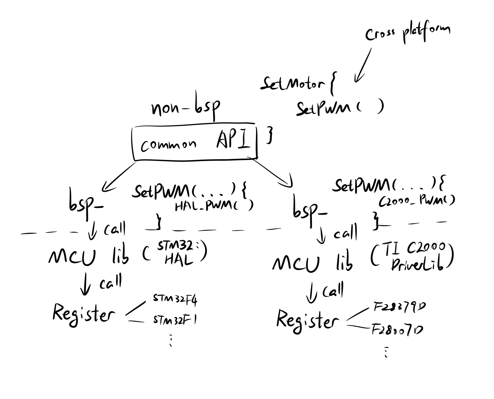
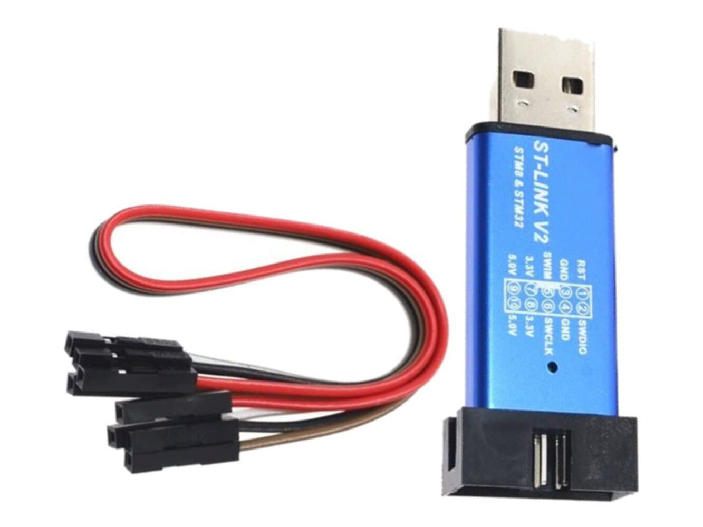
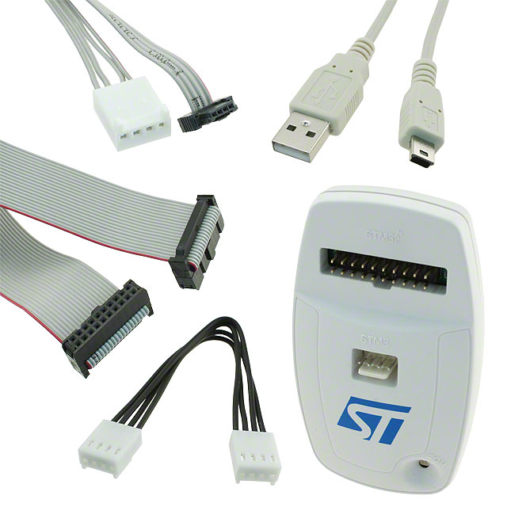
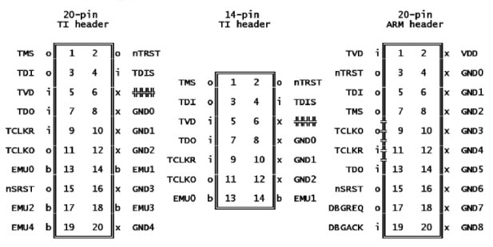
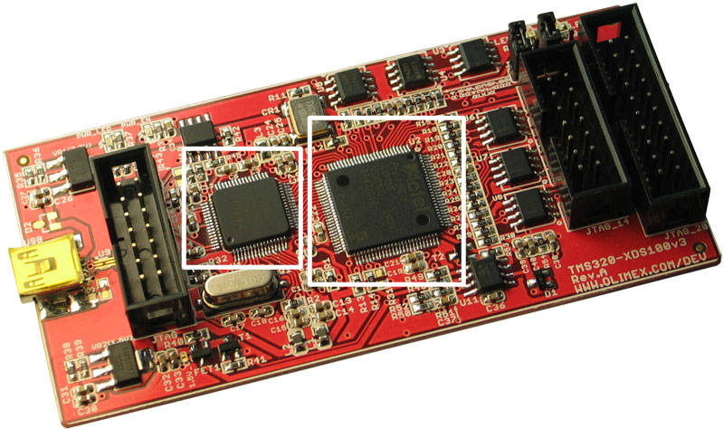

# 嵌入式IDE前额叶切除术

2024.10

如果你有一些嵌入式编程的经历，你大概会同意使用IDE并不是一件特别愉快的事。Code Composer Studio, Keil, 或者STM32CubeIDE……他们很不灵活，也很难搞清楚GUI之下到底在发生些什么。

我花了很多精力去研究IDE的运行原理，试图绕过IDE。应该说，今天我依然不能自信自己已经完全搞明白了嵌入式IDE。不过，我学到了很多有趣的知识，有趣到可以让我做到**把整个IDE换成开源的命令行工具**。

之后，我遇到了一些抱有同样兴趣的人，我于是就有了一个去把我的发现写下来的理由。这也是我写这篇指南的初衷：**通过将每一步用命令行工具替换，向嵌入式工程师展示从源码到单片机上的程序，嵌入式IDE里面到底发生了什么**。

即便你不打算把IDE换成命令行工具，我也希望你能在这篇指南中找到一些有趣的东西。

## 在电脑上从命令行编译

电脑使用由0和1组成的机器码，每个CPU家族又使用一种彼此之间略有不同的机器码。最常见的例子大概是AMD的ARM架构和intel的x86-64架构了。我们把一份exe文件从一个其中一个拷贝到另一个的时候，很可能*这个exe要么没法运行，要么运行得十分缓慢（因为Windows在实时翻译）。

>我没真的试过，StackOverflow上有人说这是真的。

用机器码写程序为世界上每一个CPU写程序是不现实的。所以人们决定用一些高级语言（比如C/C++）写程序。如果每个CPU都能提供一个翻译器，把高级语言翻译成自己的机器码，那么我们用高级语言写的程序就可以在任意的CPU上运行了。这个翻译器就是“编译器”。

> 这种能够在不同的CPU系列上运行的能力被称为“跨平台”。比如Python可以在ARM和x86的电脑上运行。

#### GCC

`GCC (GNU Compiler Collection)` 家族大概是最知名的C/C++编译器**。学习如何在电脑上使用`gcc`是我们理解嵌入式IDE的第一步。

> **今天的，大多数编译器其实是一个引导程序，根据输入文件和命令调用编译器，汇编器（assembler），或者链接器。

在Linux上安装`gcc`应该是很简单的。如果你使用的是Windows，你可以装一个Linux虚拟机（我用的是`vmware player 17` 和 `Ubuntu 22.04`）或者`MinGW-W64` + `Git Bash`（如果你选择了这种方法，记得把`mingw64/bin`加进PATH）

UCLA关于如何用gcc编译C/C++有一个不错的[一页纸的教程](https://web.cs.ucla.edu/classes/fall14/cs143/project/cpp/gcc-intro.html)


#### .exe, .out, and .elf

让我们看看gcc编译器输出了什么：

```bash
gcc main.c
```

在Windows上，这会生成`a.exe`

在Linux上，这会生成`a.out`

我们说过编译器把C翻译成每个CPU特有的机器码。如果我们是面向同一个CPU编译的，那么产生的两个可执行文件也应该有相同的机器码。对……对吗？

**不尽然**。即使这两个可执行文件有着相同*的机器码，这些机器码被装载在可执行文件中的方式也是有所不同的。

>*如果我们用了外界的库或者系统调用，机器码也会不相同

当我们试图在Windows上运行`a.out`或者在Linux上运行`a.exe`，他们并不能运行。因为这些可执行文件除了机器码还装有给操作系统看的一些信息。

`.exe (Executable)` 文件是一种微软操作系统特有的格式；`.out`文件则是一种被称为`Executable and Linkable Format (.elf)` 的Unix/Linux特有的文件格式

> `.elf` 和 `.out` 是同一个东西的两种名字。`a.out` 这个名字纯粹是历史遗留问题。

那么这些给操作系统看的信息是什么呢？是关于操作系统应该如何处理这个可执行文件的指令。比如说，重定位(relocation)信息：可执行文件可以让操作系统把他们放到一个指定**的内存地址来运行。

>**如果你好奇可执行文件之间是如何避免使用相同的内存地址，答案是他们不避免。由操作系统管理的虚拟内存会让所有人都以为自己在自己指定的内存地址上。

好，但是我为什么要关心这些不同的可执行文件和给OS看的额外信息呢？

因为当我们将程序烧录到没有操作系统的单片机中时，这些给操作系统看的额外信息是不需要的。我们无法烧录`.exe`或者`.elf`到单片机上，只能烧录二进制文件`.bin`或者`.hex`。这些二进制文件中，所有的东西（代码和数据）都有固定的地址。我们把这个二进制文件烧录到单片机中一个固定的地址（具体地址取决于CPU设计）。单片机的程序计数器（Program counter）每次重置的时候都会从此地址开始执行代码。

比如说，对于`STM32`单片机家族，地址通常是`0x8000000`。我们因此将二进制文件烧录到该地址：
```bash
st-flash --reset write output.bin 0x8000000
```
#### 编译之略微进阶

现如今的大多数编译器其实是引导程序，会根据输入文件的类型调用编译器，汇编程序，和链接器。

当我们运行：
```bash
gcc main.c
```

这个源文件在变成可执行文件中经历了四个步骤：预处理，编译，汇编，和链接。

应该承认我对编译并不是特别熟悉，因此如果要我自己写这一段，我大概会写得很烂。所以这里是University of North Carolina at Charlotte计算机架构导论[其中一节课的讲义](https://passlab.github.io/ITSC3181/notes/lecture02_CompilationAssemblingLinkingProgramExecution.pdf). 我觉得这个对我理解汇编的细节帮助很大。

如果你能理解：
- 下面这些命令是在做什么
- 为什么我们会想把程序写成多个源文件

那么你阅读随后的章节应该问题不大！

```bash
gcc -c main.c -o main.o
gcc -c library.c -o library.o
gcc library.o main.o -o output
```

## 如何控制单片机上的外设（需要编译的4层库）

嵌入式IDE的工程文件夹里面总是有许多，许多的文件。但是我们为什么需要这么多呢？在这一章我们来看看嵌入式库的层级结构

我们从对嵌入式库的四层结构的一个总览开始：四层分别是：**寄存器控制**和**单片机库（制造商库）**由芯片的制造者提供，**bsp库（板载库）**和**非板载库（高级功能库）**是用户（你）写的。

> 免责声明：这只是我整理工程的方法，不是一个标准方法。



#### 寄存器级别的控制

最下面的 **register level control** 是寄存器级别控制。所有单片机的行动都是由改变一些寄存器中的值控制的。比如说，想改变GPIO的输入，输出模式，我们就需要改变寄存器输入输出MUX的控制寄存器值。

寄存器级别的控制通常看起来如下：

```C
MCU STC89C52 的闪烁LED
sfr和sbit是这种MCU的特殊数据类型

/*  BYTE Registers  */
sfr P0    = 0x80;
sfr P1    = 0x90;
sfr P2    = 0xA0;
sbit led = P2^0;

int main() {
  while(1) {
    led = 0;
    delay(5000);
    led = 1;
  }
}
```

通常你不需要关心这一层，除非你在写一些非常低级别的驱动，写FPGA，或者自己做了一个硬件。

#### 单片机库（制造商库）

寄存器层之上是一层我称之为“单片机库”(MCU library)的东西。当我们在寄存器层写程序时，我们需要知道所有寄存器的**内存地址**去控制他们。这相当的麻烦。所以许多单片机制造商写了自己的库，这样你，作为用户，就不需要关心寄存器层了。`stm32`家族的`HAL`，`TI 2000`家族的`DriverLib`都属于此类。

单片机库的代码往往看起来如下：

```C
在单片机STM32F1上闪烁LED
...
while (1)
{
  HAL_GPIO_WritePin(GPIOC, GPIO_PIN_9, 0);
  HAL_Delay(100);
  HAL_GPIO_WritePin(GPIOC, GPIO_PIN_9, 1);
}
...
```

使用制造商库的另一个好处是许多属于同一家族的MCU会共享一个相同的制造商库API。上面这个例程使用的是`STM32F1`，如果我们希望换成它的近亲`STM32F4`，我们可以使用完全相同的程序来实现功能，因为这两个单片机的API是相同的。

#### 非板载库（高级库）

整个板载库（bsp库）的存在意义就是让高级库可以跨平台，所以我们现在先跳过 bsp 库，看看非 bsp 库（高级库）试图做什么。高级库的 API 取决于你（用户）想要构建的嵌入式系统的目的。如果设计得当，使用高级库控制你的嵌入式系统应该是非常方便的。

比如说为冰箱编写固件， `SetTemperature()` 可能就是高级库中非常有用的函数。这个函数不可能是单片机库（MCU library）的一部分，因为不是每个用户都使用这个单片机来制造冰箱，对他们来说在单片机库里的 `SetTemperature()` 就是一个无用的函数。

假设我们想要写一个 LED 阵列来显示数字（像数字时钟一样）并使用 PWM 来控制亮度。使用设计得当的高级库，我们使用高级库的最终用户代码可以非常简单：

```C
在LED阵列上显示数字4

led_array_t led_array = {some initialization here};
int main() {
  while (1) {
    DisplayNumber(led_array, 4);
    SetBrightness(led_array, 0.5); // 设置亮度为 50%
  }
}
```
#### bsp库

现在我们回到bsp库。bsp库是单片机库和高级库之间的桥梁层。我们在高级库和bsp库之间定义一个通用API，然后用单片机库实现这个通用API。

例如，如果我们想用`stm32`的`HAL`库实现上面例子中的`SetBrightness()`函数，实现方式可能是这样的：


```C
in led_array.c, 高级库
void SetBrightness(led_array_t *dev, float input) {
  SetPWM(dev, input);
}

in bsp_pwm.c, bsp 库
// 我没测试过这个
void SetPWM(led_array_t *dev, float input) {
  uint32_t compare = input * dev->TIME_PERIOD;
  __HAL_TIM_SET_COMPARE(dev->htim, dev->channel, compare);
}
```

使用`TI C2000`的`Driverlib`，实现可能是这样的：

```C
in led_array.c, 高级库
void SetBrightness(led_array_t *dev, float input) {
  SetPWM(dev, input);
}

in bsp_pwm.c, bsp 库
// 我没测试过这个
void SetPWM(led_array_t *dev, float input) {
  uint32_t compare = input * dev->TIME_PERIOD;
  EPWM_setCounterCompareValue(dev->pwm_base, dev->compare_id, compare);
}
```

由于我们定义了通用 API `SetPWM()`，高级库的实现在不同的单片机上可以保持不变。这就是我们所说的跨平台。**如果我们更改为略有不同的单片机或单片机库发生变化，bsp 库和高级库之间的通用 API 允许我们只更改 bsp 库实现，而不是所有最终用户代码或高级库。**

## 如何编译大量源文件（makefile 和 CMake）

上一章我们介​​绍了所有的库，一个工程中会有大量源文件，而且数量会不断增加。我们不能像第一章那样手动编译所有的源文件，我们需要一种自动化的方法来管理这些编译。所以， `makefile` 和 `CMake`。

我觉得很多 makefile 和 CMake 教程缺乏的一点，是他们没有强调 **target** 的核心思想。所以我写了一点东西，作为对这些教程的补充。本章可以作为一个在阅读其他 CMake/makefile 教程之前的导读。

假设我们有 2 个源文件，`hello.c` 和 `main.c`。我们想将这两个源文件编译成一个可执行文件。从第一章**从命令行编译**中，我们知道如何使用 `gcc` 来执行这个操作：

```bash
gcc hello.c main.c
```

如果我们希望输出可执行文件的名称是 `main.elf`，将其放在文件夹 `build/` 中，再指定使用 `C11` 标准，并添加隐藏的 `#define DEBUG` 宏以在源代码中启用某些调试设置，这个命令会变成：

```bash
gcc hello.c main.c -o build/main.elf -std=c11 -DDEBUG
```

随着我们想要添加的参数越来越多，命令会变得越来越长。**Makefile** 是一种脚本语言，它允许我们不必每次都输入长命令。现在我们只需要输入：

```bash
make build/main.elf
```

> 想在 Windows 上用 MinGW 这样做需要把 `mingw32-make.exe` 重命名为 `make.exe`

`make` 将在调用它的目录中寻找一个叫 `makefile` 的文件，并执行其中的命令。让我们看看例子里面的这个 `makefile` 文件写了什么：

```makefile
build/main.elf: hello.c main.c
    gcc hello.c main.c -o build/main.elf -std=c11 -DDEBUG
```

`build/main.elf` 是 **target（目标）**（这是 makefile 和 CMake 最重要的概念）。对于 makefile 脚本中的每个目标，`make` 将检查它是否存在，并且**仅**在目标不存在时执行命令。

`hello.c` 和 `main.c` 是 **依赖项**。如果这些文件自上次构建以来发生了更改，`make` 也会执行该命令。`make`记录着依赖的关系树，并只重新编译必要的文件来节省编译的时间。

`gcc ……`就只是命令。请注意，命令前必须是一个 `tab`，不能是 `空格`。

现在我们知道了命令运行的两个条件：**目标不存在或依赖关系已更改**。我们可以编写一些有趣的 makefile 脚本。

如果一个命令没有创建对应的目标，那么每次我们 `make` 时都会运行此命令，因为目标始终缺失。例如：

```makefile
clean:
    rm *.out *.elf
```

如果我们运行 `make clean`，`makefile` 将在当前目录中查找名为 `clean` 的文件。由于没有这样的文件，命令将运行，当前目录中的所有 `.out` 和 `.elf` 文件都将被删除。

> 如果真的有一个名为 `clean` 的文件，搜索关键词：`.PHONY`

#### CMake

CMake 是我们的 makefile 太长，以至于我们需要编写另一个脚本来生成 makefile 脚本的“另一个脚本”。就像`makefile` 在当前目录中查找名为 `makefile` 的文件一样，`CMake` 会查找名为 `CMakeLists.txt` 的文件。最常见的用例是：

```bash
mkdir build
cd build
cmake ..
make <your target name>
```

许多关于 CMake 的教程过于关注使用细节，在我看来，这让它们变得冗长和难懂。当你阅读这些教程时，只要记住一件事：**（像 makefile 一样），CMake 只关心目标（target）**。

回想一下， makefile 的一切都是关于目标的，makefile 中的每一行都是关于生成一个目标的。CMake 生成 makefile，所以 **如果未定义目标，那么这个 CMake 不会做任何事。**

**CMake 中只有 3 个函数会创建目标**：

```cmake
# 可以使用 GCC 或类似 GCC 的编译器生成的可执行文件
add_executable()

# 可以使用 GCC 或类似 GCC 的编译器生成的库 (.a/.so 文件)
add_library()

# 从其他命令行工具生成的内容
# 比如说，生成文件的 python 脚本
# ...或者什么都没有，还记得 make clean 吗？
# 我们可以使用这个将程序烧录到单片机
add_custom_target()
```

前两个函数 `add_executable()` 和 `add_library()` 将检测目标是否已创建以及依赖项是否被更改，就和 `makefile` 一样。但是，第三个函数 `add_custom_target()` 无论如何都会执行。因此，`add_custom_target()` 的一个小技巧是将其与二进制文件烧录一起使用，例如：

```c
add_custom_target(flash-${name}
    COMMAND st-flash --reset write ${BIN_FILE} 0x8000000
    DEPENDS ${name}.elf)
```

`st-flash` 是 `STM32` MCU 系列的烧录引导程序。现在，每次我们运行 `make flash-<your binary name>` （例如 `make flash-led`）时，`st-flash` 都会将 `led.elf` 烧录到我们的单片机中。


就是这样，所有的一切都是关于目标的，这就是 CMake 的核心思想。无论定义了多少变量添加了多少 `execute_process()`，如果没有要生成的目标， CMake 就不会执行任何命令。**无论 CMake 结构看起来多么复杂或可怕，找出这个 CMake 正在构建的目标，一切都会变得简单明了。**

记住到这一点，你应该能够理解大多数的 CMake 教程。

> CMake 是一个无底深坑，这也是我想尽量压缩本章内容的原因。要在坑里挖多深取决于你自己。GLHF。

## 为什么电脑可以针对单片机进行编译（交叉编译和工具链）

要将源文件编译为可执行文件。我们可以简单地执行以下操作：

```bash
gcc main.c
```

回想一下**第 1 章：在电脑上从命令行进行编译**的开头，我们知道：

1. 不同的单片机/CPU使用不同的机器代码
2. 一个平台（CPU + 操作系统）的可执行文件无法在另一个平台上运行。

等下！当我们在计算机上为嵌入式系统编译时，我们在电脑上编译，程序是如何能在单片机上运行的？答案就是所谓的**交叉编译**。

让我们看看**编译**和**交叉编译**之间的区别：


> 该图不太准确，因为 `.elf` 不直接在裸机嵌入式系统上运行，需要额外的后处理步骤。

对于一个源文件 `.c`，如果我们想在电脑上运行它，我们会用 `gcc` 编译它；如果我们想在 ARM 架构的单片机上运行它，我们会用电脑上的交叉编译器 `arm-gcc` 进行交叉编译，然后生成的可执行文件就可以在嵌入式系统上运行。

交叉编译器 `arm-gcc` 是芯片架构设计者提供的 **交叉编译工具链** 之一。如果我们使用的是 ARM 架构的单片机，我们可以从 ARM 获取我们的交叉编译工具链：[ARM Toolchain](https://developer.arm.com/downloads/-/arm-gnu-toolchain-downloads). 这是一个 GNU Arm Toolchain，这意味着它是我们在前面章节中讨论过的 `gcc` 家族的一个变体，并且与 `makefile` 和 `CMake` 兼容。其使用方法与一般的在电脑上编译是完全相同的。

#### 比方说：

比如我们的电脑是 x86-64 Ubuntu，我们的单片机是 ARM 架构 STM32F4。这是一个**裸机目标**，这意味着它上面没有任何操作系统。所以我们知道应该使用 `x86_64 Linux 上的，针对 AArch32 架构裸机目标的交叉工具链 (arm-none-eabi)`，我们的交叉编译器是 `arm-none-eabi-gcc`。

我们可以像 `gcc` 一样调用它：

```bash
arm-none-eabi-gcc main.c -o main
```

但这个程序不会做太多事情。还记得我们需要所有的 4 层库吗？我们迟早需要使用 `CMake`。要在我们的 `CMake` 脚本中使用这些交叉编译器，可以添加以下命令：

```cmake
set(CMAKE_C_COMPILER arm-none-eabi-gcc)
set(CMAKE_CXX_COMPILER arm-none-eabi-g++)
```

这些命令将 `CMake` 的默认编译器从 `gcc` 更改为 `arm-none-eabi-gcc`，生成的命令将使用 `arm-none-eabi-gcc` 进行编译。

arm 工具链编译器编译的生成结果是我们在第一章中讨论过的 `.elf` 文件。

> 有时这个文件也称为 `.axf` 文件，即 ARM 可执行文件（ARM executable file）。

一个`.elf` 文件包含有关重定位（relocation）的为操作系统准备的信息，指导操作系统如何将数据和代码的不同部分放入内存。裸机嵌入式单片机无法理解这些信息，因此我们需要在加载程序之前解决这个问题。

这里我们使用的工具是 `objcopy`，它可以把 `.elf` 文件转换为二进制文件 `.bin` 或 `.hex`。

```bash
arm-none-eabi-objcopy -Obinary intput.elf output.bin
```

现在我们可以将程序烧录到我们的单片机中了。我们使用开源的 `stlink` 库：

```bash
st-flash --reset write output.bin 0x8000000
```

这里的 `0x8000000` 是我们的单片机`STM32F4` 的起始地址。对于不同的 单片机，我们需要查阅芯片技术手册来获得这个烧录地址。单片机在重置后永远是从这个地址开始运行代码的。

## 烧录器/调试器/仿真器里面有什么

作为在单片机中烧录和调试代码的最后一步，我们需要一个“烧录器”。它看起来像这样：





<br>
<br>

它们有很多名字。
- 烧录器
- FTDI 芯片
- SWD 芯片或 JTAG 芯片
- 调试器
- 仿真器

我们将在本章随后逐个解释每个名称的意义，现在让我们先看看它们是如何连接到我们的硬件的。

在电脑端一般是USB接口，在嵌入式端，根据芯片制造商的不同，我们可以有很多选择：

- TI 20 针和 14 针 JTAG 接口。
- ARM 20 针 JTAG 接口。
- ST SWD 接口。


#### JTAG



JTAG 并非专门为单片机调试而发明的。它的设计初衷是检测芯片的所有引脚是否正确焊接。这项测试被称为“边界扫描”。

JTAG 应当可以设置系统中的所有的寄存器或引脚的值。如果我们想使用 JTAG 进行调试，我们会在设计系统时把所有芯片都通过 JTAG 数据线链接，然后我们开始为每个引脚注入数据。

当 JTAG 为系统中所有芯片的所有引脚设置值时，我们注入的位数应该等于系统中的引脚数。通过查看结果（如果注入的位数和系统中的引脚数两个数字相等），我们就知道芯片是否正确焊接。一些人说 JTAG 是为“边界扫描”而设计的，他们指的就是这个过程。

当我们说“JTAG”时，我们指的是 独立于被测试芯片的传播 JTAG 数据的debug硬件 + 从 JTAG 硬件到被测试芯片的物理连接，这两者的总和。

> 当然，JTAG 要求被测试芯片在其设计中包含一些 JTAG 电路才能用。与调试成本相比，这真的很小的代价了。

这是我找到的最好的 JTAG 入门教学：`https://www.fpga4fun.com/JTAG1.html`

#### SWD（与 JTAG 相比）

如果您从未使用过 ARM 芯片，您可能从未听说过 SWD（Serial Wire Debug）连接器。SWD 是 JTAG 的修改版本，仅用于 STM32 等 ARM Cortex 芯片。

SWD 建立在 JTAG 之上。因此，如果芯片支持 SWD，它也支持 JTAG。SWD 需要 2 个引脚：`SWDIO` 和 `SWDCLK`。JTAG 需要 4 个引脚：`TMS`、`TCLK`、`TDO` 和 `TDI`。事实上，它们的一些引脚是兼容的（`SWDIO == TMS`，`SWDCLK == TCLK`），这就是为什么你有时会看到可以同时用于 SWD 和 JTAG 的连接器。

<br>

对于支持两种接口的芯片，它们在冷启动时默认为 JTAG，只有在复位线上收到 50 个时钟周期的高电平，一个 16 位的命令帧，再加一个 50 个时钟周期的复位线上的高电平，才会切换到 SWD模式。

#### 同一个东西，不同的名字...

我们在本章一开始就说过，这些烧录器有很多名称。现在让我们逐个解释它们都出自哪里。

**烧录器(Loader/Flasher)**：

这个比较直接。大多数单片机在重置时会从固定地址开始执行代码。以 STM32 为例，地址为 `0x80000000`。加载程序时，我们将程序的开头烧录到单片机的起始地址。这就是为什么它被称为烧录器。

**SWD/JTAG 芯片**：

这些是我们在上一部分讨论过的用于调试的 2 种接口的名称。

**调试器/仿真器 (Debug probe/Emulator)**

要解释调试器和仿真器之间的区别稍微有点麻烦。要解释这一点，我们首先要知道为什么烧录器有时被称为 **FTDI 芯片**。 FTDI 是一家以其 USB-JTAG 芯片（FT2232 系列）而闻名的芯片公司，其公司名已经牢牢与与 USB-JTAG 芯片绑定在了一起。

回想一下上一节关于 JTAG 的内容，我们知道 JTAG 可以将程序加载到内存中：因为我们知道 JTAG 可以为系统中的所有寄存器设置值，其中包括“内存地址寄存器 (MAR)”和“内存数据寄存器 (MDR)”。也就是说，JTAG 可以通过正确的输入组合将访问任意内存地址，再把任意值写进这个地址。我们的代码也可以这样被写入内存。

如果我们只想将程序烧录到单片机，那么我们只需要一个 JTAG 芯片（FTDI 芯片）和电脑上的配套的软件驱动。但是，如果我们仔细观察查看烧录器，我们会发现它除了 FTDI（JTAG）芯片还有其他的芯片。那么这些是什么？

<br>

上图是德州仪器 TMS320 系列单片机的 XDS100v3 烧录器/调试器。白色方块中较小的芯片是 FTDI 芯片（FT2232H）。那这个较大的芯片是做什么用的？答案是添加断点进行调试用的。

当断点被添加时，我们需要看着程序计数器的值，并在地址等于断点地址时停止程序。这在电脑上是一件很容易事，但在嵌入式系统中，我们始终是需要外部硬件来添加这些断点的。有些 MCU 含有特殊的内部电路允许用户添加断点，但这种硬件可以添加的断点数量通常非常有限。

>对于 TMS320F2837 单片机，我们在没有任何外部硬件的情况下最多只能添加两个断点。

因此，烧录器在目标单片机和 FTDI 芯片之间添加了另一个中间单片机。当我们向目标单片机发送 JTAG“命令”时，中间单片机会捕获该命令并根据这些命令控制目标单片机。当需要更多断点时，中间单片机使用其内存记录所有断点地址，并在程序计数器中的地址匹配断点地址时停下目标单片机的运行。**由于烧录器上的这个中间单片机仿真了目标单片机，使得 JTAG 像直接在控制目标单片机一样，因此烧录器也被称为仿真器。**

对于某些单片机系列，中间芯片还承担了 USB-JTAG 转换的工作，因此不需要 FTDI 芯片。例如，STM32 系列的 ST-link。


<br><br>

## 调试是什么原理（OpenOCD、GDB、gdb server）

`GDB`（GNU Debugger）是一个非常重要的调试工具。有很多关于它的优秀教程。比如University of Maryland的 [这个讲义](https://www.cs.umd.edu/~srhuang/teaching/cmsc212/gdb-tutorial-handout.pdf) 或University of Michigan的 [这个一页参考单](https://web.eecs.umich.edu/~sugih/pointers/summary.html)。

大多数 GDB 入门教程仅讨论调试本地程序，一些在你的计算机上编译、运行和调试的程序。对于加载到单片机中的程序，我们知道它会在你的计算机上编译，但不会在你的计算机上运行。从上一章我们知道我们可以使用调试器对其进行调试，但具体该怎么做呢？

如果我们想通过调试器使用 GDB 和 GDB 指令调试我们的单片机，我们就需要 GDB 和调试器之间的软件中间人。我们要找的东西叫做 **GDB 服务器(server)**。它读取发送到端口*的 GDB 指令并将其转换为调试器的相应指令。

>*socket端口，也就是说你可以通过网络远程调试单片机。

我们在这里用作示例的 GDB 服务器是 **OpenOCD**。世界上有这么多不同的调试器，我们需要找到我们的调试器的 **调试器配置文件**来告诉OpenOCD我们用的是哪一种。 OpenOCD 附带许多常见的调试器配置文件，例如我们正在使用的配置文件：`st-link-v2.1`。

要设置 GDB 服务器：

```bash
openocd -f st-link-v2-1.cfg
```

如果调试器已连接到我们的电脑，OpenOCD 应该会检测到并开始等待 GDB 的连接。

1. 假设我们将程序编译为 output.elf
```bash
arm-none-eabi-gcc -g main.c -o output.elf
```

2. 要启动 GDB：
```bash
arm-none-eabi-gdb output.elf
```

这会将我们正在调试的程序提供给 GDB。注意这时我们尚未将此程序烧录到单片机中。烧录将在步骤4时，由 GDB + OpenOCD 完成。

3. 运行 GDB 命令：
```bash
target extended-remote : 3333
```

这让 GDB 连接到端口 3333 上的 GDB 服务器，这是 OpenOCD 的默认端口。`extended-remote` 确保即使 单片机上的程序结束，GDB 也不会退出与 gdbserver 的连接，这让我们的得以多次运行单片机上的程序。相比之下，`target remote: 3333` 一旦程序完成就会退出。

4. 运行 GDB 命令：
```bash
load
```

这会将我们正在调试的程序烧录到单片机上。从这里我们就可以像调试任何其他程序一样在 GDB 中进行调试了。


## 实例分析：以`illini-robomaster`为例

现在我们有了所需的所有前置知识，我们可以逐行分析一下 [`illini-robomaster/iRM_Embedded_2023`](https://github.com/illini-robomaster/iRM_Embedded_2023)，这个不使用 IDE 的嵌入式固件repo。

这个repo针对的是单片机 `STM32F407` 和 `STM32F427`，两者都是 ARM 架构 单片机。固件则主要包括电机控制。使用的工具链是 Linux x86-64 上用于裸机目标的 ARM GNU 工具链（`arm-none-eabi-<something>`）。烧录器硬件是 `SWD` 接口的 st-linkv2，驱动程序则是 [st-link](https://github.com/stlink-org/stlink) 。调试器是以 `OpenOCD` 作为 gdb 服务器的 ARM gdb。

这个repo使用 `C++` 作为主要语言，`CMake` 作为构建系统，`FreeRTOS` 作为操作系统。

> 操作系统“FreeRTOS”是作为程序的一部分烧录进单片机的。这些单片机都是裸机。

首先，我们将编译器设置为 ARM GNU 工具链中的那个：
```cmake
set(CMAKE_C_COMPILER arm-none-eabi-gcc)
set(CMAKE_CXX_COMPILER arm-none-eabi-g++
```
现在，使用 `add_executable` 或 `add_library` 创建的每个目标都将使用 `arm-gcc` 而不是 `gcc` 创建。

#### 从源代码到可执行文件
repo中有 3 个主要文件夹：
- shared/
- boards/
- examples/

###### shared/

`shared/` 文件夹包含所有 `bsp` 和 `非bsp (高级)` 库。

所有 `bsp` 库都位于 `shared/bsp/` 目录中。在 CMake 中，这些源文件被定义为 `BSP_SOURCES` 变量。所有  `非bsp (高级)`  源文件被定义为 `LIB_SOURCES` 变量。然后将两个源文件集合再次定义为 `IRM_SOURCES`：

```CMake
# bsp 库
file(GLOB_RECURSE BSP_SOURCES ${CMAKE_CURRENT_SOURCE_DIR}/bsp/*.cc)
# 高级库
file(GLOB_RECURSE LIB_SOURCES ${CMAKE_CURRENT_SOURCE_DIR}/libraries/*.cc)
# 组合
set(IRM_SOURCES ${BSP_SOURCES} ${LIB_SOURCES})
```

这些源文件随后被添加到 CMake 函数 `irm_add_board_specific_library` 中的一个库里面。如果开发板是`DJI_Board_TypeA`，则生成的库是`DJI_Board_TypeA_irm`：

```cmake
# 取自 irm_add_board_specific_library()，参数已展开
add_library(DJI_Board_TypeA_irm OBJECT ${IRM_SOURCES})
```

`DJI_Board_TypeA_irm`这个库随后将与`boards/`中的单片机（制造商）库结合。

###### boards/

`boards/` 文件夹包含一些修改过的单片机（制造商）库。单片机库由 `STM32CubeMX` 从外设设置文件 `.ioc` 生成。此文件夹中的每个子目录都是一种开发板的单片机 库（`DJI_Board_TypeA(STM32F407)`、`DJI_Board_TypeC(STM32F427)` 等）。

根据单片机库的类型，`boards/` 中的源文件被分为 3 个库。对于 `DJI_Board_TypeA` 开发板，这三个库是：
- `DJI_Board_TypeA_interface`：单片机库（STM32 的 HAL 库）、文件系统（FATFS）、操作系统（FreeRTOS）
- `DJI_Board_TypeA_libDSP`：`DJI_Board_TypeA_interface` 和数字信号处理库
- `DJI_Board_TypeA`：所有源文件，也包括上面 2 个库。

`DJI_Board_TypeA_interface` 随后被合并到由 `bsp` 和 `高级` 库生成的 `DJI_Board_TypeA_irm` 库中：

```CMake
# 来自函数 irm_add_board_specific_library()，展开了一些参数
target_link_libraries(DJI_Board_TypeA_irm
    PUBLIC DJI_Board_TypeA_interface
    PRIVATE ${ARG_DEPENDS}) # 这个参数是空的
```

> 附注：CMake `PUBLIC` 与 `PRIVATE`<br><br>
> 如果你在创建共享库，并且你的 cpp 源文件 `#include` 了另一个库的头文件，但你的头文件不包含另一个库的头文件，则此“另一个库”是 `PRIVATE` 依赖项。如果你的源文件和头文件都include了另一个库的头文件，那么它就是 `PUBLIC` 依赖项。<br><br>
> 来源：https://stackoverflow.com/a/26038443/25509701

###### examples/

最后，`DJI_Board_TypeA_irm`（`shared/` 中的所有东西与 `boards/` 中的一些东西）和 `DJI_Board_TypeA`（`boards/` 中的所有东西）被链接到生成的可执行文件。

> 是的，有些东西是重复的。但又[不是我设计的](https://github.com/jayphelps/git-blame-someone-else) 这个编译系统，好吗？

比如，要生成另一个 LED 闪烁的可执行文件，我们为 `led.cc` 在它附近的 `CMakeLists.txt`里面调用一些函数：

```CMake
irm_add_arm_executable(led_typeA
    TARGET DJI_Board_TypeA
    SOURCES led.cc)
```

`DJI_Board_TypeA_irm`（`shared/` 中的所有内容以及 `boards/` 中的某些内容）和 `DJI_Board_TypeA`（`boards/` 中的所有内容）会和 `led.cc` 链接生成 `led.elf`。

```CMake
# 函数 irm_add_arm_executable() ，展开了一些参数
add_executable(${name}.elf ${ARG_SOURCES}) # ARG_SOURCES 是我们的例程
target_link_libraries(${name}.elf
    PRIVATE DJI_Board_TypeA DJI_Board_TypeA_irm)
```

`examples/` 中有 50 多个源文件。每个文件都是一个独立的单元测试，可以生成自己的可执行文件。如果我们使用 IDE，那么我们会需要 50 个项目，因为一个 IDE 项目只能生成一个可执行文件。

###### 单元测试是怎么在没有 `main()` 的情况下运行的？

这是闪烁 LED 单元测试的代码，我们可以看到它是没有 `main()`的。怎会如此？这是因为 `main()` 函数在 `boards/` 中，而不是 `examples/` 中。

```c
// led.cc
#include "bsp_gpio.h"
#include "cmsis_os.h"
#include "main.h"

static bsp::GPIO *gpio_red;

void RM_RTOS_Init(void) {
  gpio_red = new bsp::GPIO(LED_RED_GPIO_Port, LED_RED_Pin);
  gpio_red->High();
}

void RM_RTOS_Default_Task(const void* args) {
  while (true) {
    gpio_red->Toggle();
    osDelay(500);
  }
}
```

在 `boards/` 中，因为我们要使用操作系统 `FreeRTOS`，我们在 `main.c:main()` 中调用了函数 `osKernelStart()`。然后用 `freertos.c` 中的 `osThreadNew()` 创建了默认线程 `StartDefaultTask()`。

```c
// main.c
int main() {
  ...
  /* 启动调度程序 */
  osKernelStart();
  ...
}
```

`StartDefaultTask()` 是一个给定的函数，用户（我们）可以将任何内容写入函数主体。`StartDefaultTask()` 在这个repo所做的唯一一件事就是调用 `__weak` 函数 `RM_RTOS_Default_Task()`。`__weak` 关键字允许另一个具有相同名称（签名）的函数覆盖它。

每个示例源文件都实现了它们用作主函数的 `RM_RTOS_Default_Task()`。每个源文件的实现都会覆盖 `boards/` 中的 `__weak` 函数，并成为最终可执行文件的线程。

```c
// freertos.c
/* 在用户程序那一层实现以下函数 */
__weak void RM_RTOS_Default_Task(const void *argument) { UNUSED(argument); }
/* creation of defaultTask */
defaultTaskHandle = osThreadNew(StartDefaultTask, NULL, &defaultTask_attributes);
/* USER CODE END Header_StartDefaultTask */
void StartDefaultTask(void *argument)
{
  /* init code for USB_DEVICE */
  MX_USB_DEVICE_Init();
  /* USER CODE BEGIN StartDefaultTask */
  RM_RTOS_Default_Task(argument);
  /* Infinite loop */
  for(;;)
  {
    osDelay(1);
  }
  /* USER CODE END StartDefaultTask */
}
```

#### 烧录可执行文件：

要将此代码库从源代码编译为可执行文件，我们从一些基本的编译命令开始：

```bash
mkdir build && cd build
cmake ..
make
```

现在，每个example源文件都被编译成了可执行文件。要将一个example（单元测试）刷入单片机，例如 led example，我们运行：
```bash
make flash-example_led
```

这是如何做到的？我们来看 CMake 函数 `irm_add_arm_executable()`：

我们知道，没有操作系统的单片机 无法运行带有重定位（relocation）信息的可执行文件。我们需要将其转换为没有内存重定位信息的二进制文件，然后我们就可以将其烧录到我们的单片机中。

```cmake
# 构建可执行文件
add_executable(${name}.elf ${ARG_SOURCES})

# 使用 objcopy 从可执行文件生成二进制文件
set(BIN_FILE ${CMAKE_CURRENT_BINARY_DIR}/${name}.bin)
find_program(ARM_OBJCOPY arm-none-eabi-objcopy REQUIRED)
add_custom_command(TARGET ${name}.elf POST_BUILD
    COMMAND ${ARM_OBJCOPY} -Obinary $<TARGET_FILE:${name}.elf> ${BIN_FILE})
```

转换实际所用的命令是 `arm-none-eabi-objcopy -Obinary input.elf output.bin`。

> add_custom_command() 不会创建目标。相反，它会在构建目标 `${name}.elf` 时运行指定的命令。

最后，使用custom target完成加载：

```cmake
add_custom_target(flash-${name}
    COMMAND st-flash --reset write ${BIN_FILE} 0x8000000
    DEPENDS ${name}.elf)
```
